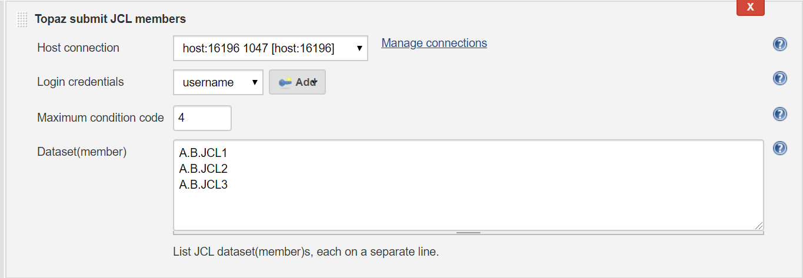
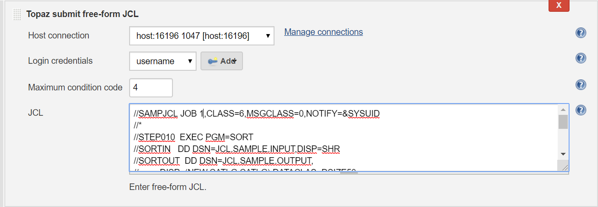

# Compuware Topaz Utilities

  

## Overview

This plugin provides access to various Compuware Topaz (R) utilities, such as submitting Jobs on the mainframe.

## Prerequisites

The following are required to use this plugin:
- Jenkins
- Jenkins Credentials Plugin
- Topaz Workbench CLI version 19.02.01 or later. Refer to the [Topaz Workbench Install Guide](https://docs.compuware.com/kb/KB2001/PDF/TopazWorkbench_Install.pdf) for instructions.
- A valid Topaz for Program Analysis, Topaz for Enterprise Data or Topaz for Total Test license
- Host Communications Interface

## Installing in a Jenkins Instance

1. Install the Compuware Topaz Utilities plugin according to the Jenkins instructions for installing plugins. Dependent plugins will automatically be installed.
2. Install the Topaz Workbench CLI on the Jenkins instances that will execute the plugin. The Topaz Workbench CLI is available in the Topaz Workbench installation package. If you do not have the installation package, please visit [support.compuware.com](https://support.compuware.com/). For Topaz Workbench CLI installation instructions, please refer to the [Topaz Workbench Install Guide](https://docs.compuware.com/kb/KB2001/PDF/TopazWorkbench_Install.pdf).

## Configuring for Topaz Workbench CLI & Host Connections

In order to use Topaz utilites you will need to point to an installed Topaz Workbench Command Line Interface (CLI). The Topaz Workbench CLI will work with host connection(s) you also need to configure to use Topaz utilities.

Navigate to Manage Jenkins / Configure System and go to Compuware Configurations section.

- **Windows Topaz Workbench CLI home** : Point to the Windows installation location of the CLI. If necessary, change the default values given to match the correct installation location.

- **Linux Topaz Workbench CLI home** : Point to the Linux installation location of the CLI. If necessary, change the default values given to match the correct installation location.

 The Topaz Workbench CLI must be installed on the machine that is configured to run the job.

**Host connections**

 If no host connection appears in the Host Connections section, click Add Host Connection.

- **Description** : Enter a description of the connection.

- **Host:port** : Enter the z/OS host and port to connect to.

- **Encryption protocol** : Select the desired encryption protocol to be used for this connection. The encryption protocol is used to encrypt data sent to and from the host. The default is \'None\'.

- **Code page** : Select the desired code page to be used for this connection. The code page is used to translate data sent to and from the host. The default is 1047.

- **Read/write timeout (minutes)** : Enter the number of minutes for the plugin to wait for a response from the host before timing out.

- **CES URL** : Optionally, enter a URL for Compuware Enterprise Services (CES). This URL is used by other Compuware plugins that leverage REST APIs hosted by CES, for example Compuware's ISPW.

### Submit JCL datasets or members on the mainframe

This integration allows submitting JCL datasets or members on the mainframe.

On the **Configuration** page of the job or project, in the **Build** section, from the **Add build step** list, select **Topaz submit JCL members**.

This build action has following parameters:

- **Host connection** : Select the host connection to be used to connect to the z/OS host.

 Alternatively, to add a connection, click **Manage connections**. The **Host connections** section of the Jenkins configuration page appears so a connection can be added.

- **Login credentials** : Select the stored credentials to use for logging onto the z/OS host.

 Alternatively, click **Add **to add credentials using the [Credentials Plugin](https://plugins.jenkins.io/credentials/). Refer to the Jenkins documentation for the Credentials Plugin.

Do the following:

- **Maximum condition code** :  Enter the maximum condition code or keep the default value. The submitting of JCL jobs will terminate if any job's return code is greater than the maximum condition code.

- **Dataset(member)** : List JCL dataset / dataset(member)s, each on a separate line.

If desired, repeat the steps above to add more build steps.

Click **Save** and run the job.

### Submit free-form JCL on the mainframe

This integration allows submitting of free-form JCL on the mainframe.

On the **Configuration** page of the job or project, in the **Build** section, from the **Add build step** list, select **Topaz submit free-form JCL**.

This build action has following parameters:

- **Host connection** : Select the host connection to be used to connect to the z/OS host.

 Alternatively, to add a connection, click **Manage connections**. The **Host connections** section of the Jenkins configuration page appears so a connection can be added.

- **Login credentials** : Select the stored credentials to use for logging onto the z/OS host.

 Alternatively, click **Add **to add credentials using the [Credentials Plugin](https://plugins.jenkins.io/credentials/). Refer to the Jenkins documentation for the Credentials Plugin.

Do the following:

- **Maximum condition code** :  Enter the maximum condition code or keep the default value. The submitting of JCL jobs will terminate if any job's return code is greater than the maximum condition code.

- **JCL** : enter JCL

If desired, repeat the steps above to add more build steps.

Click **Save** and run the job.

## Using Pipeline Syntax to Generate Pipeline Script

- Do one of the following:

    - When working with an existing Pipeline job, click the **Pipeline Syntax** link in the left panel. The **Snippet Generator** appears.

    - When configuring a Pipeline job, click the **Pipeline Syntax** link at the bottom of the **Pipeline **configuration section. The **Snippet Generator** appears.

- **Sample Step** : Select **General Build Step** .

- **Build Step** : Select **Topaz submit JCL members** or **Topaz submit free-form JCL**.

- Complete the displayed fields.

- Click **Generate Pipeline Script**. The Groovy script to invoke the step appears. The script can be added to the Pipeline section when configuring a Pipeline job. A sample script is shown below:

~~~
stage("Submit JCL Members") {
    node {
        step([$class: 'topazSubmitJclMembers',
        connectionId: '0274970b-bade-48c1-b726-a95b84c4abbb', 
        credentialsId: '0f6dbaa8-2cac-4968-a67b-fc97819ec413', 
        jclMember: '''A.B.JCL1
        A.B.JCL2
        A.B.JCL3(MEMBER)''', 
        maxConditionCode: '4'])
    }
}
~~~

## Known Limitations

-   The browser default header size may not be suitable when submitting large free-form JCL. This can be remedied by modifying the jenkins.xml file located at the root of where your Jenkins is installed. Update the jenkins.xml arguments as follows:
    - Modify the Jenkins service arguments, but adding, or changing if already present, argument: **requestHeaderSize**; a sample of the arguments is shown below:

~~~
<arguments>-Xrs -Xmx256m -Dhudson.lifecycle=hudson.lifecycle.WindowsServiceLifecycle 
-jar "%BASE%\jenkins.war" --httpPort=8080 --webroot="%BASE%\war" --requestHeaderSize=128000</arguments>
~~~

## Product Assistance

Compuware provides assistance for customers with its documentation, the Compuware Support Center web site, and telephone customer support.

### Compuware Support Center

You can access online information for Compuware products via our Support Center site at [https://support.compuware.com](https://support.compuware.com/). Support Center provides access to critical information about your Compuware products. You can review frequently asked questions, read or download documentation, access product fixes, or e-mail your questions or comments. The first time you access Support Center, you must register and obtain a password. Registration is free.

### Contacting Customer Support

At Compuware, we strive to make our products and documentation the best in the industry. Feedback from our customers helps us maintain our quality standards. If you need support services, please obtain the following information before calling Compuware\'s 24-hour telephone support:

- The Jenkins job console output that contains any error messages or pertinent information.

- The name, release number, and build number of your product. This information is displayed in the Jenkins / Plugin Manager and go to the Installed tab. Apply filter: Compuware in order to display all of the installed Compuware plugins.

- Job information, whether the job uses Pipeline script or Freestyle project.

- Environment information, such as the operating system and release on which the Topaz CLI is installed.

You can contact Compuware in one of the following ways:

#### Phone

- USA and Canada: 1-800-538-7822 or 1-313-227-5444.

- All other countries: Contact your local Compuware office. Contact information is available at [https://support.compuware.com](https://support.compuware.com/).

#### Web

You can report issues via Compuware Support Center: [https://support.compuware.com](https://support.compuware.com/).

Note: Please report all high-priority issues by phone.

### Corporate Web Site

To access Compuware\'s site on the Web, go to [https://www.compuware.com](https://www.compuware.com/). The Compuware site provides a variety of product and support information.

## Change Log

See [Change Log](https://github.com/jenkinsci/compuware-topaz-utilities-plugin/blob/master/CHANGELOG.md)